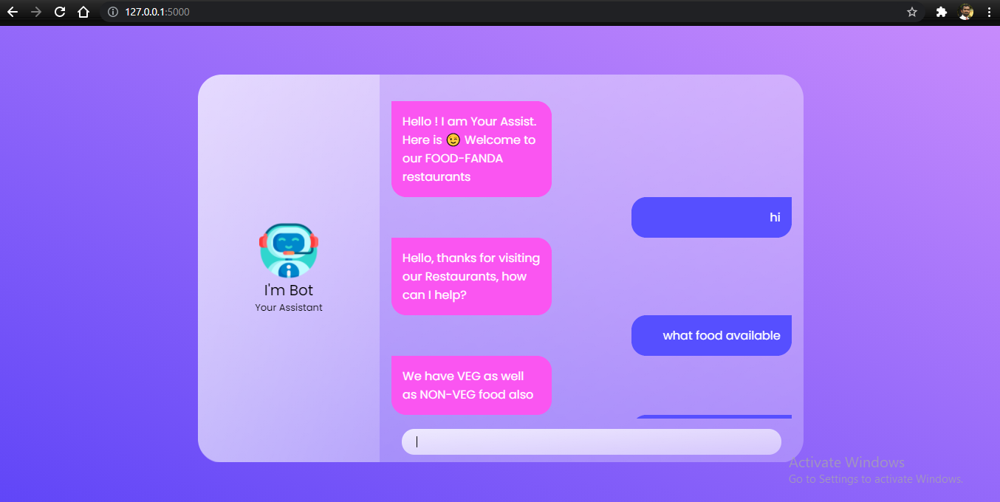
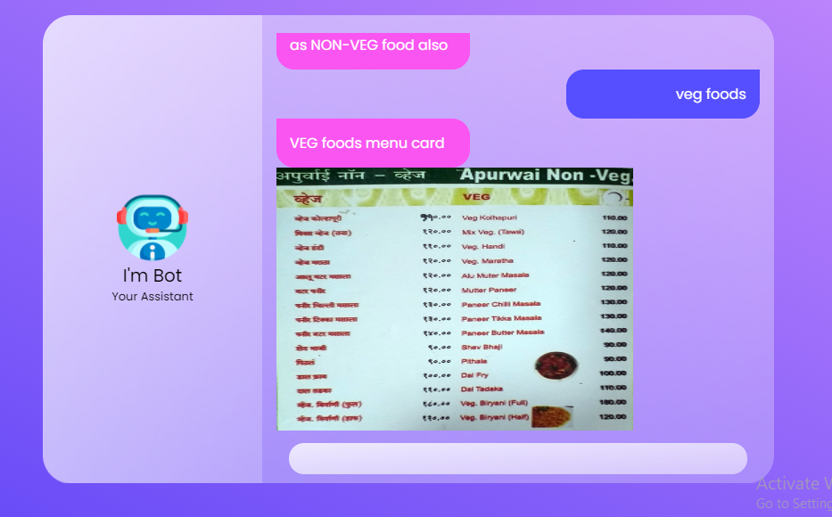
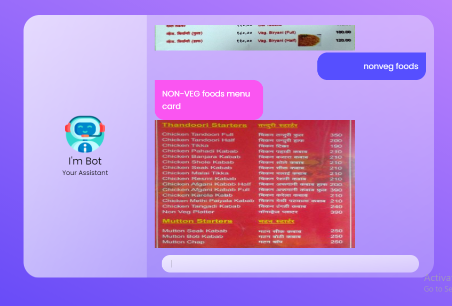
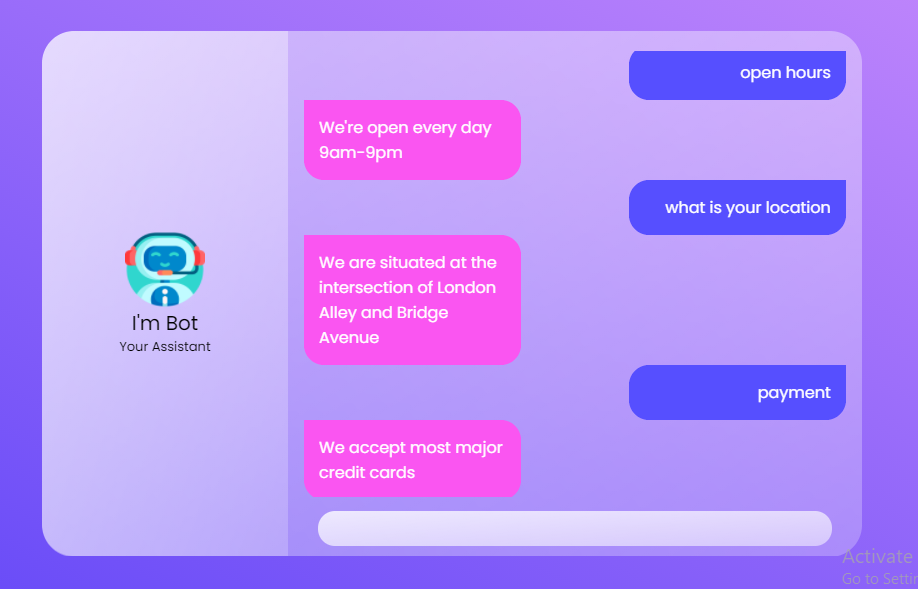
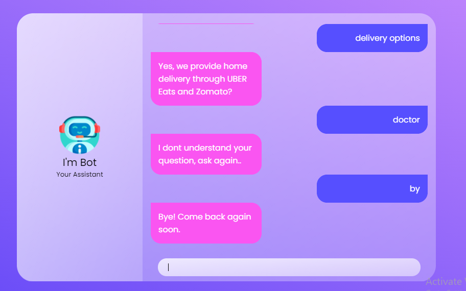
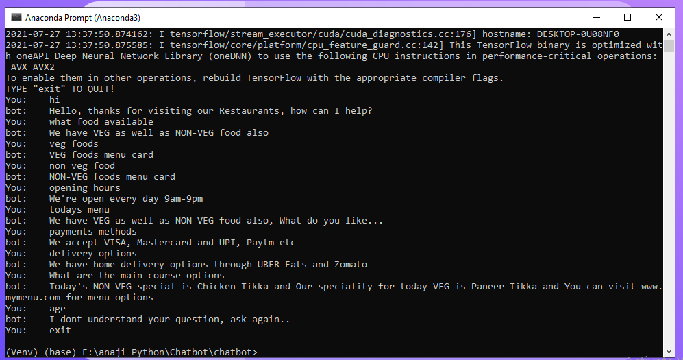
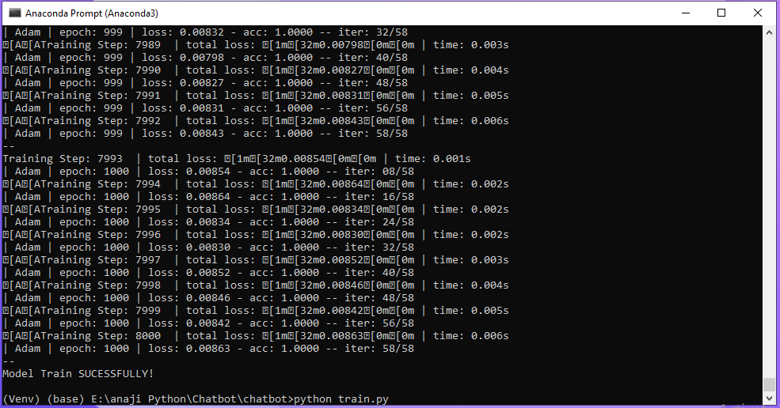

# ChatBot

## clone:
``` git clone  https://github.com/anajikadam/Chatbot.git ```

## create Virtual Environment:
``` cd Chatbot ```

``` python -m venv Venv```

``` Venv\Scripts\activate ```

``` pip install -r requirements.txt ```

## Run: 
``` python app.py ```

## Screenshot








